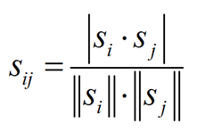

# 前言

在使用今日头条、网易云音乐等应用的时候，发现它们都会精准的推荐相关信息给用户，于是对背后的推荐算法产生了兴趣。正好今后的工作可能需要“为商品推荐达人们汇总出一些当季的、相关性的商品”，也许会和推荐算法有一定联系。本DEMO是对**[基于物品的协同过滤算法](https://en.wikipedia.org/wiki/Item-item_collaborative_filtering)**（Item-based collaborative filtering recommendation algorithms, itemCF）的学习，算是入职前的热身吧。


开发环境：hadoop-2.6.0


---

# 原理

itemCF思想：根据用户对商品的行为，计算商品和商品相似度， 找到和当前商品最相近的进行推荐。 


假设有用户：A、B、C，有商品：1、2、3、4、5、6，用户对商品有四种行为：点击、搜索、收藏、付款。对这四种行为进行简单的量化：点击1分、搜索3分、收藏5分、付款10分。用户行为如下表所示：

| 用户   | 物品   | 行为   |
| ---- | ---- | ---- |
| A    | 1    | 点击   |
| C    | 3    | 收藏   |
| B    | 2    | 搜索   |
| B    | 5    | 搜索   |
| B    | 6    | 收藏   |
| A    | 2    | 付款   |
| C    | 3    | 付款   |
| C    | 4    | 收藏   |
| C    | 1    | 收藏   |
| A    | 1    | 点击   |
| A    | 6    | 收藏   |
| A    | 4    | 搜索   |


---

## 根据用户行为计算用户、物品的评分矩阵

输入：用户ID、物品ID、分值

输出：物品ID（行）	用户ID（列）\_分值（值），用户ID（列）\_分值（值） ...


在HDFS中，**用户、物品的评分矩阵**表示为：

```
1	A_2,C_5
2	A_10,B_3
3	C_15
4	A_3,C_5
5	B_3
6	A_5,B_5
```


---

## 根据用户、物品的评分矩阵计算物品与物品的相似度矩阵

有关物品之间的相似度，最为简单的方式是采用余弦相似度进行计算。



输入：用户、物品的评分矩阵

缓存：用户、物品的评分矩阵

输出：物品ID（行）		物品ID（列）\_相似度（值），物品ID（列）\_相似度（值）...


在HDFS中，根据用户、物品的评分矩阵通过余弦相似度得到物品与物品的相似度矩阵，如下：

```
1	1_1.00,2_0.36,3_0.93,4_0.99,6_0.26
2	1_0.36,2_1.00,4_0.49,5_0.29,6_0.88
3	4_0.86,3_1.00,1_0.93
4	1_0.99,4_1.00,6_0.36,3_0.86,2_0.49
5	2_0.29,5_1.00,6_0.71
6	1_0.26,5_0.71,6_1.00,2_0.88,4_0.36
```


---

## 相似度矩阵 × 评分矩阵 = 推荐列表

输入：物品与物品的相似度矩阵

缓存：用户、物品的评分矩阵

输出：物品ID（行）	用户ID（列）\_分值（值），用户ID（列）\_分值（值）...


在HDFS中，推荐列表如下：

```
1	A_9.87,B_2.38,C_23.90
2	A_16.59,B_8.27,C_4.25
3	C_23.95,A_4.44
4	B_3.27,C_22.85,A_11.68
5	A_6.45,B_7.42
6	C_3.10,A_15.40,B_9.77
```


---

## 过滤掉之前已经给用户推荐过的商品

已经给用户推荐过的商品，则不需要再次进行推荐。该步骤根据**用户行为**数据过滤掉之前已经给用户推荐过的商品。


输入：物品与物品的相似度矩阵

缓存：用户、物品的评分矩阵

输出（最终的推荐列表）：用户ID（行）	物品ID（列）\_分值（值），物品ID（列）\_分值（值）...


在HDFS中，最终的推荐列表如下：

```
A	5_6.45,3_4.44
B	4_3.27,1_2.38
C	6_3.10,2_4.25
```

描述：

对于用户A，推荐5号商品的分值是6.45，推荐3号商品的分值是4.44

对于用户B，推荐4号商品的分值是3.27，推荐1号商品的分值是2.38

对于用户C，推荐6号商品的分值是3.10，推荐2号商品的分值是4.25


---

# 参考

[Item-item collaborative filtering](https://en.wikipedia.org/wiki/Item-item_collaborative_filtering)

[搜索推荐系统是如何实现的？](https://www.zhihu.com/question/19677762)

[推荐系统与应用](https://blog.csdn.net/joycewyj/article/details/51692976)

